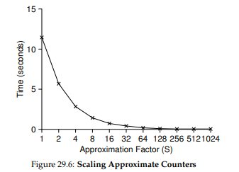

# Manejo de estructuras que usan loops #

## Fuentes de consulta ##
1. Material de clase (Videos y diapostivas).
2. Texto guia [**Operating Systems: Three Easy Pieces**](http://pages.cs.wisc.edu/~remzi/OSTEP/). Para desarrollar este laboratorio se recomienda tener a la mano el capitulo [Lock-based Concurrent Data Structures](http://pages.cs.wisc.edu/~remzi/OSTEP/threads-locks-usage.pdf)

## Ejercicios ##

1. Consulte el uso de la función ```gettimeofday``` para medir el tiempo de ejecución de un programa
   * ¿Cómo se utiliza esta función (muestre un ejemplo)? 
   * ¿Cuál es el intervalo de tiempo más corto que se puede medir con esta función?
2. Consulte cuantas CPUs hay disponibles en el sistema que esta utilizando. (Pista use el comando lscpu)
2. Crear un contador concurrente simple y mida cuánto tiempo lleva incrementar el contador muchas veces a medida que aumenta el número de hilos (1, 2, 4, 8, 16). Para tal fin, siga las instrucciones que aparecen en el directorio  [preciso](./preciso). Una vez complete los pasos, continue con el tercer punto.
3. Crear una versión del contador aproximado (sloppy counter) y mida su desempeño a medida que se varía el número de hilos, en este caso, solo maneje un umbral de S = 1024 variando el numero  de hilos (1, 2, 4,8, 16). Las intrucciones para ello se encuentran en el directorio [aproximado](./aproximado).
4. Grafique los resultados obtenidos de las pruebas recopiladas (en las tablas) para el **numero de hilos .vs. el tiempo (en segundos)**, estas siguen la tendencia de la figura **29.5** del libro (la cual se muestra a continuación):


   * Los valores siguen una tendencia como la que se muestra en el texto guía (mostrada anteriormente)?
   * ¿Cuántas CPU hay disponibles en el sistema que está utilizando?  
   * ¿Este número afecta de alguna manera sus mediciones?

5. Mejore el archivo [test_aproximate_mejorado_counter.c](./aproximado_mejorado/test_aproximate_counter.c) de tal modo que ademas de permitir modificar el numero de hilos y el valor maximo del contador a emplear, permita modificar tambien el umbral o factor de apromación (S), para esto se puede basar en el ejercicio 3. De este modo los parametros serán:
   * Umbral: ```APPROXIMATION_FACTOR```
   * Valor maximo del contador: ```MAXCNT```
   * Numero de hilos que seran lanzados: ```NUMTHREADS```
   
Segun lo anterior, la forma de pasar argumentos a la aplicación será la siguiente una vez este completamente terminada:  

```
./NOMBRE_EJECUTABLE <APPROXIMATION_FACTOR> <MAXCNT> <NUMTHREADS>
```

Luego, ejecute varias veces la aplicación dejando constante el valor maximo del contador maximo a 10000000 y el numero de hilos a 4 pero cambiando el valor del umbral a los siguientes valores: 1, 2, 4, 8, 16, 32, 64, 128, 256, 512 y 1024. ¿La grafica sigue una tendencia similar a la mostrada en la figura **29.6** del texto guia (la cual se muestra a continuación)?

